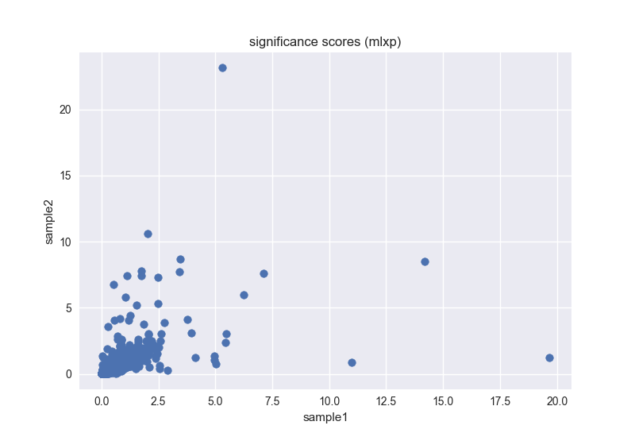

# Example phip-stat workflow for Nature Protocols

This README follows the general protocol in the Nature Protocols PhIP-seq paper
with a bit of fake example data.


## Getting started

First, create a working directory

```bash
mkdir workdir
cd workdir
```

and download the example data from the Google
Storage bucket:

https://console.cloud.google.com/storage/ll-nat-prot-ex-data

To avoid downloading the individual files one-by-one, you can use Google's
`gsutil` tool

```bash
gsutil -m cp -r gs://ll-nat-prot-ex-data/* .
```

See below for notes on installing `gsutil`.


## Running the workflow

Reads for two samples are available in `reads/`.  We will align them with
`bowtie` to the reference index available in `ref/` and place the results in
`alns/`.


```bash
mkdir -p alns
bowtie -n 3 -l 100 --best --nomaqround --norc -k 1 -p 4 --quiet bowtie_index/mylibrary reads/sample1.fastq.gz alns/sample1.aln
bowtie -n 3 -l 100 --best --nomaqround --norc -k 1 -p 4 --quiet bowtie_index/mylibrary reads/sample2.fastq.gz alns/sample2.aln
```

Now we aggregate the aligned reads into counts for each sample.  We supply the
reference "input" count values since they are replicated into each count file.
The input counts are used for the regression analysis.

```bash
phip compute-counts -i alns -o counts -r ref/ref_input_counts.tsv
```

Finally we compute significance scores for the count values with a Generalized
Poisson model.

```bash
mkdir -p mlxp
phip compute-pvals -i counts/sample1.tsv -o mlxp/sample1.mlxp.tsv
phip compute-pvals -i counts/sample2.tsv -o mlxp/sample2.mlxp.tsv
```

And we merge the values for each sample into a single tab-delim file.

```bash
phip merge-columns -i mlxp -o mlxp.tsv -p 1
```

This file can then be used for downstream analysis.  For example, here we
generate a scatter plot of the two samples.

```python
import pandas as pd
import matplotlib.pyplot as plt
import seaborn as sns
mlxp = pd.read_csv('mlxp.tsv', sep='\t', header=0, index_col=0)
fig, ax = plt.subplots()
ax.scatter(mlxp.sample1, mlxp.sample2)
ax.set(xlabel='sample1', ylabel='sample2', title='significance scores (mlxp)')
fig.show()
```

which should look like




## Installing gsutil

Google's documentation on how to install `gsutil` is available here:

https://cloud.google.com/storage/docs/gsutil_install

For a quick and dirty installation that's not guaranteed to work, run

```
# python2 req'd for gsutil; leave out -p python2 if python2 is your default
virtualenv -p python2 gcs
source gcs/bin/activate
# pinned to older version because https://github.com/GoogleCloudPlatform/gsutil/issues/470
pip install six==1.9.0
pip install gsutil
```

Now you can use gsutil in your virtualenv.
